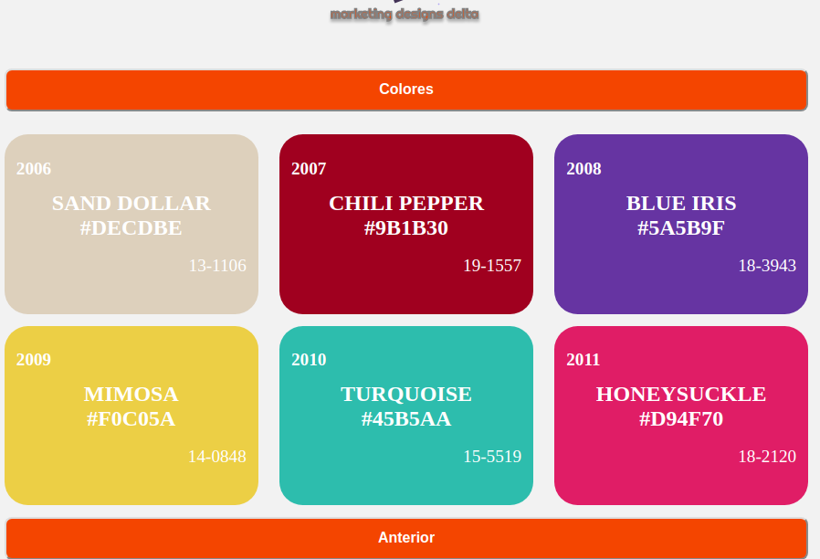

# 
# AppColor

Esta es una aplicación que permite copiar de forma rápida la paleta de colores de una organización, para que esté disponible al momento que los desarrolladores o diseñadores lo requieran siendo de mucha ayuda para agilizar el trabajo. 

## Prototipo 

## Cómo instalar la aplicación 💻
Para instalar la app tienes que:
1. Descargar el zip.
2. Descomprimirlo.
3. Entrar en la cónsola y ubicarte en la carpeta del proyecto.
2. Correr `npm install .`
3. Correr `npm run start`

## Stack utilizado
 
- React.js
- Flexbox
- React Hooks
- react-copy-to-clipboard Library
- Emotion

## Deploy 

[link](https://eloquent-chandrasekhar-c700ec.netlify.app)

